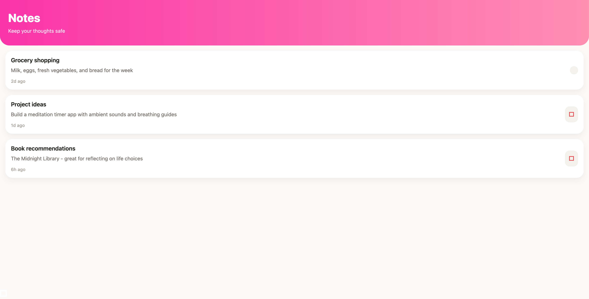

<p align="center">
  
</p>

<h1 align="center">Interstellar</h1>

<p align="center">
  <strong>Describe an app. Watch it orbit into existence.</strong>
</p>

<p align="center">
  <a href="#getting-started">Getting started</a>&nbsp;&nbsp;·&nbsp;&nbsp;
  <a href="#how-it-works">How it works</a>&nbsp;&nbsp;·&nbsp;&nbsp;
  <a href="#testing">Testing</a>&nbsp;&nbsp;·&nbsp;&nbsp;
  <a href="#swapping-components">Swapping components</a>&nbsp;&nbsp;·&nbsp;&nbsp;
  <a href="#contributing">Contributing</a>
</p>

<p align="center">
  <a href="LICENSE"></a>
  <a href="CONTRIBUTING.md"></a>
</p>

<br />

Interstellar is a designer's coding agent. You type an idea in chat; an AI agent designs and builds a real, native **Expo Router** app — with multiple screens, real navigation, seeded content, and a crafted design identity — and serves a live preview directly in your browser.

```
Prompt: "a meditation app with a breathing timer"

→ AI designs the full app (tokens, layout, 4 screens, components)
→ Uploads to a Daytona sandbox
→ Renders live in an iPhone frame in your browser
```

<p align="center">
  
  <br />
  <em>The studio — a generated app running live in the iPhone frame.</em>
</p>

---

## Getting started

You'll need:

- **Node 22.6+** — the test runner uses native TypeScript type-stripping
- An [Anthropic](https://console.anthropic.com/) API key — powers the coding agent
- A [Daytona](https://app.daytona.io/) account — runs the live Expo previews
- A [Convex](https://convex.dev/) account — free tier is fine

### 1. Clone + install

```bash
git clone https://github.com/oezguercelebi/interstellar.git
cd interstellar
npm install     # .npmrc sets legacy-peer-deps — see CONTRIBUTING.md for why
```

### 2. Environment template

```bash
cp .env.example .env.local    # then fill in your Anthropic + Daytona keys
```

### 3. Convex project

```bash
npx convex dev --once --configure
```

This creates/selects a Convex cloud project and **appends** `CONVEX_DEPLOYMENT` and
`NEXT_PUBLIC_CONVEX_URL` to your `.env.local` (that's why the template comes first).

Convex actions run server-side, so mirror the agent/sandbox vars into Convex:

```bash
npx convex env set ANTHROPIC_API_KEY sk-ant-...
npx convex env set DAYTONA_API_KEY ...
npx convex env set DAYTONA_API_URL https://app.daytona.io/api
npx convex env set DAYTONA_SNAPSHOT interstellar-studio-nw1
npx convex env set DAYTONA_TARGET eu        # your Daytona org region: eu | us
```

### 4. Bake the Daytona snapshot

This builds the **`interstellar-studio-nw1`** snapshot from a Node 20 image + a
full Expo Router app with all allowed dependencies pre-installed — including the
NativeWind (Tailwind) toolchain, so the one snapshot runs **both** starter kits
(classic StyleSheet and NativeWind) — and 4 GB memory so Metro doesn't OOM:

```bash
node scripts/bake-snapshot.mjs
```

> Until the snapshot exists, builds fall back to a slow cold path (~3–5 min per
> preview); with it, previews provision in ~30–90 s. The NativeWind starter kit
> has no cold path at all — it requires the pre-baked snapshot.
>
> **Note:** a freshly baked snapshot can take ~10–15 minutes after reaching
> "active" before Daytona's runners can schedule it. If your first build fails
> with `No available runners`, wait a few minutes and retry — it's propagation,
> not a config problem.

#### Choosing the starter kit — and the rollout order

`STARTER_KIT` (a Convex env var) picks the starter kit for **new** generations:
unset (or any unknown value) means the classic StyleSheet kit;
`npx convex env set STARTER_KIT nativewind` switches new apps to the NativeWind
kit. Every version is stamped with its kit at creation — edits of old projects
keep their original kit forever, regardless of later env flips.

**Upgrading an existing deployment? Only this order is safe:**

1. Deploy the code (classic stays the default while `STARTER_KIT` is unset).
2. Bake the new snapshot: `node scripts/bake-snapshot.mjs`.
3. `npx convex env set DAYTONA_SNAPSHOT interstellar-studio-nw1` — wait out the
   schedulability window above, then verify one **classic** first-gen preview
   AND one reopen of a pre-upgrade version (the snapshot is a superset; classic
   apps must still run on it).
4. `npx convex env set STARTER_KIT nativewind`.

Rollback levers, each independent: `npx convex env unset STARTER_KIT` (instant —
new generations revert to classic) and restoring the previous `DAYTONA_SNAPSHOT`
(full snapshot rollback). Fresh installs just bake once, set
`DAYTONA_SNAPSHOT=interstellar-studio-nw1`, and may set `STARTER_KIT` right away.

### 5. Preview proxy region

The live preview is served through a same-origin proxy that targets your Daytona
region's preview domain. The default is the EU pool (`daytonaproxy01.eu`). **If your
Daytona org is in another region**, set the suffix in `.env.local`:

```
DAYTONA_PREVIEW_SUFFIX=<your-suffix>
```

Find it by opening any sandbox preview URL — it looks like
`https://8081-<sandbox-id>.<suffix>`.

### 6. Start

```bash
npm run dev:all    # starts Convex + Next.js together
```

Open http://localhost:3000.

> **Heads-up:** there is no authentication — every visitor to your deployment shares
> the same workspace. That's perfect for local use and demos; add auth before hosting
> it on the public internet.

---

## How it works

```
"a meditation app with a breathing timer"
               │
               ▼
┌──────────────────────────────┐
│  Next.js (App Router)        │   chat UI · studio · landing
└──────────────┬───────────────┘
               ▼
┌──────────────────────────────┐
│  Convex                      │   durable agent + file storage
│   ├─ @convex-dev/agent       │   Claude (Haiku / Sonnet / Opus)
│   └─ @convex-dev/workflow    │   parallel variant generation
└──────────────┬───────────────┘
               ▼
┌──────────────────────────────┐
│  Daytona                     │   live Expo preview sandboxes
└──────────────┬───────────────┘
               ▼
   a live iPhone frame in your browser
```

The **files table** is the source of truth. The agent emits every file through a `writeFile`
tool — not its text output — making generation resumable, streamable, and diffable. The studio
renders each file the instant it lands.

Module map and the hard seam rules (zero-regeneration, frozen string-ref surface, mirror contracts) live in [CLAUDE.md](CLAUDE.md).

### Tech stack

| Layer | Choice | Notes |
|---|---|---|
| Frontend | Next.js 15 · React 19 | App Router, TypeScript |
| Backend | Convex | Realtime queries, durable workflows |
| AI | Claude (Haiku/Sonnet/Opus) via AI SDK v6 | Streaming, tool calls |
| Sandboxes | Daytona | Pre-baked Expo snapshot |
| Styling | Tailwind v3 + Radix | "Flight Manual" design system — see docs/BRAND.md |

---

## Testing

```bash
npm run test:pure      # pure-static unit tests, ~0.2s — run on every change
npm run typecheck      # tsc --noEmit
```

Full end-to-end (provisions a real Daytona sandbox, no model call):

```bash
npm run qa:install                   # one-time: download Playwright Chromium
npm run dev:all                      # must be running in another terminal
npm run qa:e2e -- --fixture good     # seeds a fixture app → live preview → render check
```

Pre-cleaning only deletes sandboxes created from this project's `DAYTONA_SNAPSHOT` —
your other Daytona sandboxes are never touched. See [docs/QA.md](docs/QA.md) for the
full harness guide.

---

## Design system

The UI follows the "Flight Manual" brand system ([docs/BRAND.md](docs/BRAND.md)) —
mid-century aerospace documentation meets modern editorial. Paper and ink on the
landing, a dark mission console in the studio, and one signal color
(International Orange `#FF4D00`) used only where attention is required. Serif for
wonder, mono for telemetry, flat color everywhere — no gradients.

Generated apps get a clean token-first architecture — one `theme/tokens.ts` file
drives every screen, so apps are consistently well-crafted. The agent's style system
supports Auto (AI chooses), Flight Manual, Calm Editorial, Midnight, Vivid Playful,
and Minimal Mono.

---

## Swapping components

Interstellar is opinionated, but the seams are real. Three tiers of swappability:

| Component | Swappable? | Where |
|---|---|---|
| **LLM (Claude)** | Yes — ~5 lines | `convex/agents/codegen.ts` + model IDs |
| **Sandbox (Daytona)** | Yes — implement one interface | `convex/lib/sandbox/` |
| **Backend (Convex)** | No — it's the chassis | Self-host Convex instead |

**Swapping the model.** Everything routes through the [AI SDK](https://ai-sdk.dev), so
the provider is one import. To use a different provider:

1. `convex/agents/codegen.ts` — replace `anthropic(model)` with your provider's
   factory (e.g. `openai(model)` from `@ai-sdk/openai`).
2. `convex/lib/styles.ts` + `lib/models.ts` — replace the three model IDs.
3. Drop `effortProviderOptions` (the `effort` param is Anthropic-only).

Heads-up: the design-system prompt is tuned against Claude — output taste will
vary with other models.

**Swapping the sandbox.** The whole platform contract is one interface —
`SandboxProvider` in [`convex/lib/sandbox/types.ts`](convex/lib/sandbox/types.ts):
*given the generated files, return a sandbox id + a public preview URL.*
Daytona is the only implementation today
([`daytona.ts`](convex/lib/sandbox/daytona.ts)); add Modal/E2B/Fly by
implementing the interface and registering it in
[`index.ts`](convex/lib/sandbox/index.ts). The studio UI needs no changes — any
URL that renders in an iframe works (only Daytona URLs route through the
same-origin proxy). **PRs welcome.**

**The backend is not swappable — by design.** Convex is simultaneously the
database, the realtime transport (every live UI update is Convex reactivity),
the durable workflow engine, and the agent's persistence layer. Abstracting it
would forfeit exactly those properties. If you're lock-in averse: Convex is
[open source and self-hostable](https://github.com/get-convex/convex-backend).

---

## Contributing

See [CONTRIBUTING.md](CONTRIBUTING.md) — it includes the hard-won gotchas
(snapshot sizing, peer-dep quirks, Convex agent API notes) that will save you hours.
Good first contribution: an additional `SandboxProvider` (Modal, E2B, Fly).

Go deeper:

- [docs/BRAND.md](docs/BRAND.md) — the brand system: color, type, principles
- [docs/BRIEF.md](docs/BRIEF.md) — the design brief behind the product
- [docs/QA.md](docs/QA.md) — the full QA harness guide
- [docs/convex-api-notes.md](docs/convex-api-notes.md) — verified Convex agent + workflow API notes

## License

[MIT](LICENSE)
